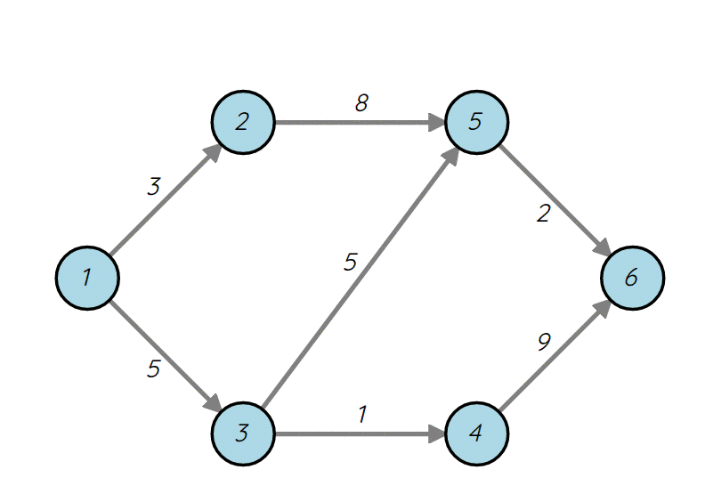
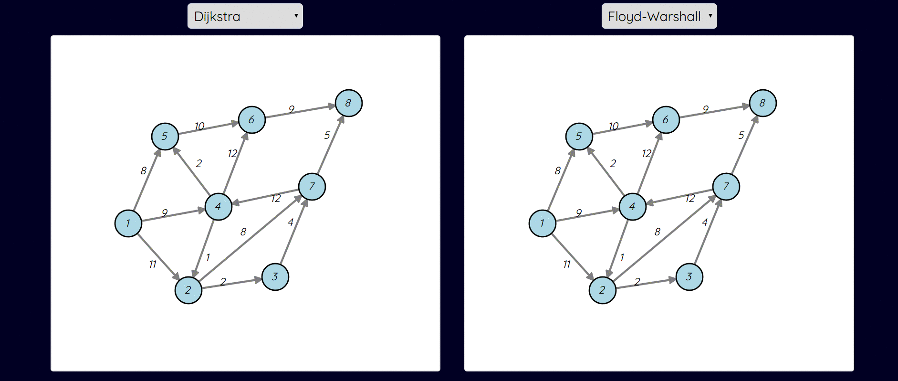
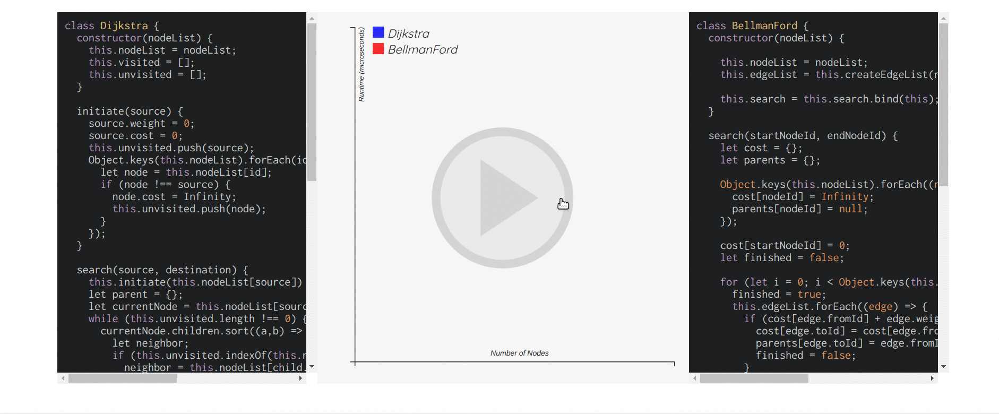

## Algo-Mapper

### Summary

While learning new algorithms, it is very common for users to get lost tracking variables, miss a conceptual step, and have trouble visualizing all the math into a physical model. So we built a full-stack web app that will allow users to walkthrough step-by-step through an algorithm and be able to compare the time-complexity of different algorithms.

[Live Link](https://algomapper.life)

### Technologies

##### _Algorithm visualizations_

Visualizations were created using `d3.js`, a data visualization library for JavaScript. This was a clear choice over pure canvas or the `Easel.js` library. Both the algorithm show pages and the comparison page use `d3.js` to colorize pre-made node maps. Due to the nature of the algorithms, each visualization was built with a different modular approach, representing how the algorithm searches through the node map.

Figure 1: AStar algorithm displayed on show page

Figure 2: Comparison page showing two different algorithms

Figure 3: Graph and code displayed, along with the ability to re-calculate the data

`d3.js` was also used to generate graphs to compare and display time complexity data for separate algorithms.

##### _Code Highlighting_

Although visualizations are helpful for understanding the core concepts of the algorithm, the pure code is of course another imperative. The show page and comparison both have code boxes that display JavaScript code that our team members developed, highlighted and formatted correctly using `react-highlight`.

### Minimum Viable Product

With this website, users will be able to:

- [ ] Pick and choose between 4 different algorithms that find shortest path,
- [ ] View a show page with algorithm visualization, details, and code,
- [ ] Comparison page that allows user to pick between two algorithms, see each of their visualizations, and differences in time complexity,
- [ ] Create example shortest path model that can be used for each algorithm,
- [ ] Can pause visualization and take it step-by-step.

__Bonus MVP__:

- [ ] Compare between different programming languages
- [ ] Compare space complexity if method is found
- [ ] Add additional algorithms

### Technical Challenges

##### Algorithms

Understanding the general concepts is one thing. Writing code that works is another. Although we do wish to have accomplished a little more on the technical side of things, we still implemented four very functional algorithms in JavaScript that properly display and calculate shortest paths.

##### Graphs and Visualizations

### Group Members and Implementation Timeline

Our group consists of four members:

- Brandon Chui
- Janice Yura Lee
- Ranelle Reyes
- Winber Xu
