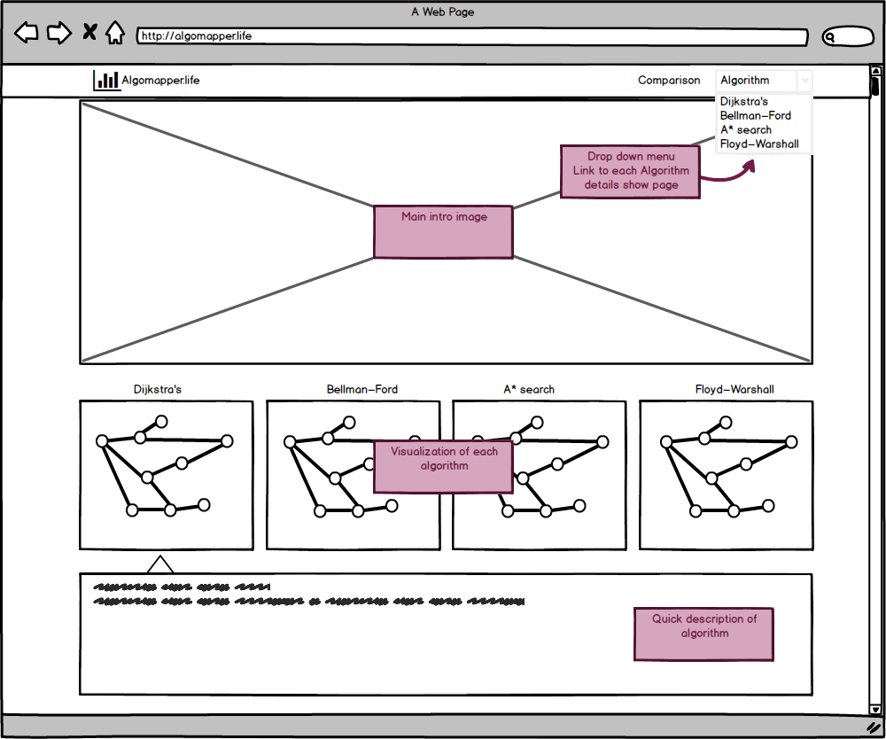
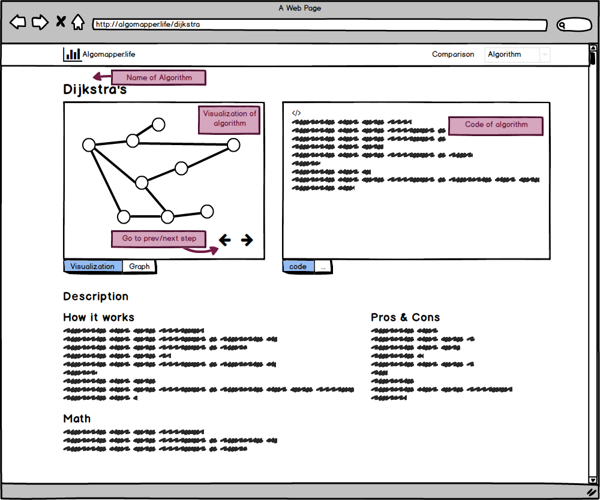

## Algo-Mapper (Flex Project Proposal)

### Background and Overview

While learning new algorithms, it is very common for users to get lost tracking variables, miss a conceptual step, and have trouble visualizing all the math into a physical model. So our team will be creating a web app that will allow users to walkthrough step-by-step through an algorithm and be able to compare the time-complexity of different algorithms.

### Functionality & MVP

With this website, users will be able to:

- [ ] Pick and choose between 4 different algorithms that find shortest path,
- [ ] Show page with algorithm visualization, details, and code,
- [ ] Comparison page that allows user to pick between two algorithms, see each of their visualizations, and differences in time complexity,
- [ ] Create example shortest path model that can be used for each algorithm,
- [ ] Can pause visualization and take it step-by-step.

__Bonus MVP__:

- [ ] Compare between different programming languages
- [ ] Compare space complexity if method is found
- [ ] Add additional algorithms

### Wireframes

Homepage, automatically displays the 4 algorithms and their visualization. Able to get quick, short blurb about a certain algorithm on click.

Compares two different algorithms. Shows a bigger visualization along with the code and a plot of time-complexity.

Detail page regarding the algorithm. Walks through how it works and the math behind the algorithm.

### Technologies & Technical Challenges

This website will utilize a Python/Django backend with a PostgreSQL database. Most of the challenges for this project will come from conceptual knowledge of algorithms and usage of D3.js along with easel.js to visualize our algorithms.

### Things we accomplished this weekend.

- Learned and experimented with git workflow.
- Tried different backends and came to conclusion to use Django backend.
- Studied different types of algorithms by watching lecture videos and reading articles, condensing our list to 4 algorithms.

### Group Members and Implementation Timeline

Our group consists of four members:

- Brandon Chui
- Janice Yura Lee
- Ranelle Reyes
- Winber Xu

#### Timeline

**Day 1**:

  - Finish any lingering problems with the backend (Winber)
  - Study our list of Algorithms and start on algorithm code (Everyone)
    - Dijkstra
    - A*
    - Bellman-Ford
    - Floyd-Warshall
  - Make Node class for usage in Algorithms (Ranelle)

**Day 2**:
  - Be close to finishing algorithm code, have testable code by this point (Everyone)
  - Start HTML Skeleton and Initial CSS (Brandon & Yura)
  - Decide on final Algos state (input/output) and integration methodology (Everyone)

**Day 3**:
  - Halfway point check-in meeting!
  - Finish overall skeleton of website (Brandon)
  - Finish up lingering algo-code and start on algorithm descriptions (Ranelle)
  - Get basic easel.js started on visualization (Winber & Yura)

**Day 4**:
  - Work on algorithm visualization (Yura & Winber)
  - Work on D3 and Time Complexity plot (Ranelle & Brandon)

**Day 5**:
  - Continue working and wrapping up on Day 4 projects
  - Start prepping for deployment/try deploying website

**DAY 6**:
  - Penultimate check-in meeting!!!
  - Clean up CSS and styling
  - Time for overflow
